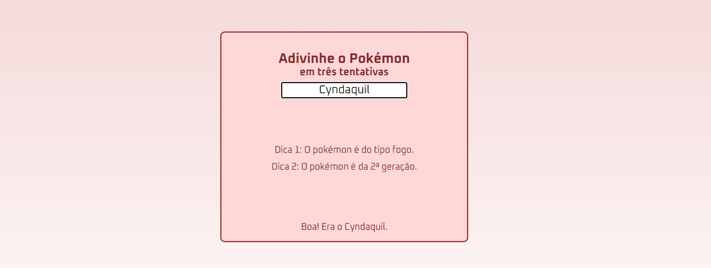

<h1 align="center">Adivinhe o Pokémon - Beta</h1>

Este código foi feito de maneira educacional para fins de aprendizado. 

  <a href="#-tecnologias">Tecnologias</a>&nbsp;&nbsp;&nbsp;|&nbsp;&nbsp;&nbsp;
  <a href="#-projeto">Projeto</a>&nbsp;&nbsp;&nbsp;|&nbsp;&nbsp;&nbsp;
  <a href="#-layout">Layout</a>&nbsp;&nbsp;&nbsp;|&nbsp;&nbsp;&nbsp;
  <a href="#memo-licença">Licença</a>

---

  

---

## 🚀 Tecnologias

Esse projeto foi desenvolvido com as seguintes tecnologias:

- HTML e CSS
- JavaScript
- Git e Github

## 💻 Projeto

O objetivo do projeto foi montar um 'Guess the number' com o tema de Pokémon para que o usuário tente adivinhar qual é o pokémon inicial escolhido randomicamente pelo código.  
Os pokémon são: Bulbasaur, Charmander, Squirtle, Chikorita, Cyndaquil, Totodile, Treecko, Torchic e Mudkip.
- [Acesse o projeto finalizado online](https://matheusdyson.github.io/lm-project/Guess-the-Pokemon/)

## 🔖 Layout

O Layout e outras imagens podem ser acessados na pasta image do projeto.

## :memo: Licença

Nennhuma licença.

---

Feito com ♥ by Luiz Antunes e Matheus Candido :thumbsup:
